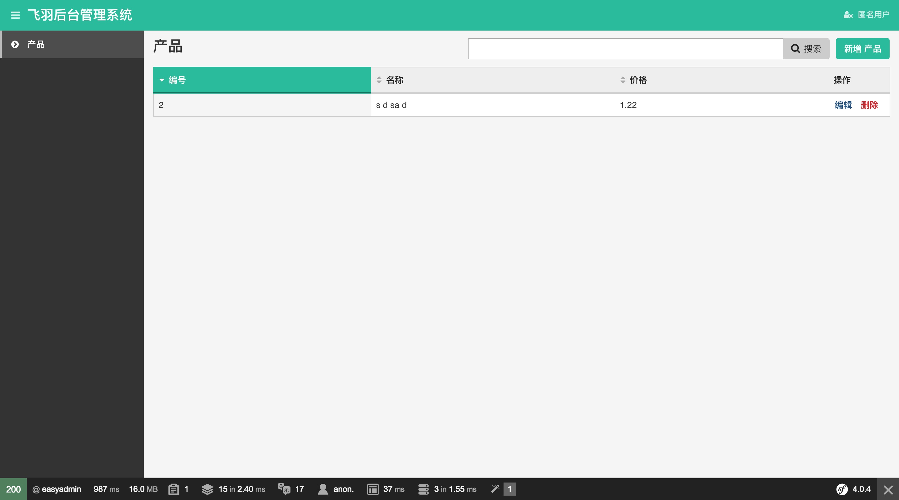

这是一个用symfony4开发的后台管理系统
=============

如何安装？
-------------

**1.下载项目 并且编译项目**

>     git clone https://gitlab.com/nligo/coffey-admin.git
>     cd coffey-admin
>     composer install

**2.配置数据库，邮件，在.env文件中进行编辑**

**3.创建数据库，更新数据表**

>     bin/console doctrine:database:create
>     bin/console doctrine:schema:update -f

**然后访问http://your.domain.com/admin/zh_CN 就可以看到**

